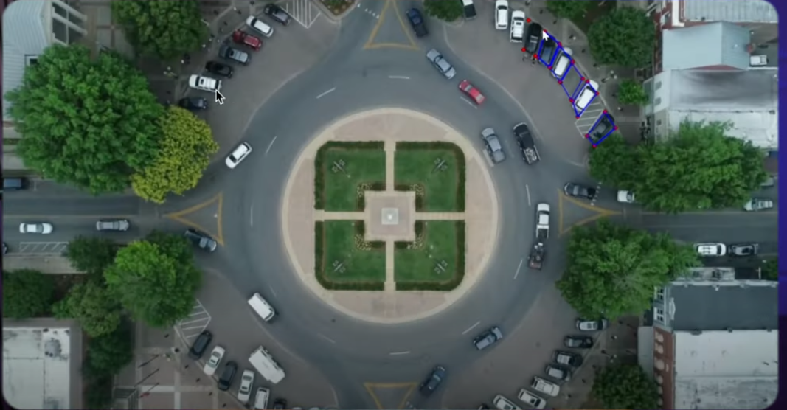

# 🧠 SmartNexxie – AI Smart Parking System


<p align="center">
  
  <br>
  <em>Figure 1: Visual Demo Diagram</em>
</p>

🔊 [Click to listen to SmartNexxie System Overview](https://raw.githubusercontent.com/danielmuthama23/SmartNexxie--AI-Smart-Parking/main/screenshot/smartnexxie-demo.mp3)

<!-- <audio controls>
  <source src="https://raw.githubusercontent.com/danielmuthama23/screenshot/smartnexxie-demo.mp3" type="audio/mpeg">
demo
</audio> -->

## 🚗 AI-Powered Parking Analytics, Blockchain Verification, RAG Assistant, and Power BI Integration

**SmartNexxie** is an end-to-end intelligent parking management platform that unifies computer vision, IoT sensor streams, retrieval-augmented prediction (RAG), and blockchain verification through **Microsoft Fabric’s Lakehouse** and **EventStream**.

This solution integrates **YOLOv8**, **PySpark**, **Vector Embeddings**, **Model Context Protocol (MCP)**, and **Power BI Dashboards** for real-time monitoring, AI-assisted predictions, and explainable analytics.

---

## 🧩 PROJECT OVERVIEW

| Component | Description |
|------------|-------------|
| `01_Complete_Setup_And_Data` | Sets up Fabric Delta tables, ingests IoT data streams & synthetic traffic datasets |
| `02_AI_Processing_Predictions` | Runs YOLO detection, AI inference, RAG embeddings, and blockchain verification |
| `03_Monitoring_Dashboard` | Monitors system health, KPIs, and real-time insights using EventStream & Spark |
| `04_OpenMirroring_Setup` | Configures Delta Lake → Mirrored replication simulation (non-Fabric environments) |
| `05_PowerBI_Advanced_Analytics` | Generates Power BI metrics, marts, and predictive business insights |
| `06_YOLOv8_Visualization` | Visual AI demo for live parking video detection and RAG explanation assistant |

---

## 🧱 SYSTEM ARCHITECTURE

            ┌───────────────────────────┐
            │  IoT Parking Sensors + CCTV│
            └────────────┬───────────────┘
                         │ (EventStream)
                         ▼
             ┌───────────────────────────┐
             │ Fabric Delta Lakehouse    │
             └────────────┬───────────────┘
                         │
         ┌───────────────┴──────────────────┐
         │                                  │
         ▼                                  ▼
┌───────────────────────┐         ┌────────────────────────┐
│ AI Processing (YOLOv8)│         │ Traffic Predictions RAG │
└─────────────┬─────────┘         └──────────┬──────────────┘
              │                              │
              ▼                              ▼
    ┌──────────────────┐          ┌────────────────────────┐
    │ Blockchain Layer │          │ Model Context Protocol │
    └────────┬─────────┘          └────────┬───────────────┘
             │                              │
             ▼                              ▼
   ┌────────────────────────────────────────────────────────┐
   │ Power BI + Fabric Dashboards + Visual RAG Assistant     │
   └────────────────────────────────────────────────────────┘


## ⚙️ SETUP INSTRUCTIONS

### 1️⃣ Environment Setup

Install dependencies:
```bash
pip install pyspark pandas numpy ultralytics opencv-python faiss-cpu sentence-transformers
pip install matplotlib python-docx openpyxl reportlab
pip install watchdog websockets
````

If using **Microsoft Fabric or Synapse**:

* Attach your Lakehouse (Delta)
* Enable EventStream and Real-Time Hub
* Run notebooks sequentially: `01 → 06`

---

## 📁 Folder Structure

```
SmartNexxie-AI-Smart-Parking/
│
├── data/
│   ├── parking_zones.json
│   ├── sample_video.mp4
│   └── mock_sensor_data.csv
│
├── models/
│   ├── yolov8n.pt
│   └── faiss_index.index
│
├── notebooks/
│   ├── 01_Complete_Setup_And_Data.html
│   ├── 02_AI_Processing_Predictions.html
│   ├── 03_Monitoring_Dashboard.html
│   ├── 04_OpenMirroring_Setup.html
│   ├── 05_PowerBI_Advanced_Analytics.html
│   └── 06_YOLOv8_Visualization.html
│
├── src/
│   ├── setup_and_data.py
│   ├── ai_processing_predictions.py
│   ├── monitoring_dashboard.py
│   ├── open_mirroring_setup.py
│   ├── powerbi_advanced_analytics.py
│   ├── yolo_visualization.py
│   └── rag_assistant.py
│
└── README.md
```

---

## 🚀 MODULES OVERVIEW

### 🏗️ 01 — Data Setup (IoT + EventStream + Delta)

* Simulates IoT sensors + CCTV feeds using watchdog and websockets.
* Streams data to Microsoft Fabric EventStream and OneLake Delta tables.
* Creates:

  * `ParkingSensorData`
  * `TrafficCameraData`
  * `HistoricalTraffic`
  * `ModelRegistry`

**Technologies:** EventStream, Spark Structured Streaming, Delta Lake, Fabric Lakehouse, Python Watchdog

---

### 🧠 02 — AI Processing (YOLO + Predictions + MCP + RAG)

* YOLOv8 for vehicle detection (ultralytics)
* RAG (Retrieval-Augmented Generation) for context-aware predictions
* Embeddings built with `sentence-transformers (all-MiniLM-L6-v2)`
* FAISS vector store for similarity search
* MCP (Model Context Protocol) for AI governance & Hedera blockchain audit
* Event-driven updates from EventStream → Model inference → Delta updates

**Technologies:** YOLOv8, PyTorch, FAISS, RAG, PySpark, Hedera SDK (simulated), EventStream

---

### 🪞 04 — Open Mirroring Setup (Delta → Simulated Mirroring)

Configures Open Mirroring between Fabric Delta tables and simulated mirrored storage (`MirroredData` DB).

* Auto-detects if running on Fabric or local Spark
* Creates mock tables if original ones don’t exist
* Simulates replication for:

  * `ParkingSensorData`
  * `TrafficCameraData`
  * `YOLOProcessedData`

**Example Execution:**

```python
from open_mirroring_setup import OpenMirroringManager
mgr = OpenMirroringManager(spark)
mgr.configure_open_mirroring()
mgr.simulate_replication()
```

**Output:**

```
🚀 STARTING OPEN MIRRORING SETUP
🔄 CONFIGURING OPEN MIRRORING FOR DELTA REPLICATION...
🧩 Non-Fabric runtime detected — switching to simulation mode.
🧱 SIMULATING OPEN MIRRORING (Local Copy Mode)...
✅ Mock table created: ParkingDataLakehouse.ParkingSensorData
✅ Mirrored table created: MirroredData.ParkingSensorData (2 rows)
🏁 Mirroring simulation completed successfully.
```

---

### 📊 03 — Monitoring & Dashboard

* Tracks parking occupancy, YOLO accuracy, and blockchain verification
* Streams live data to Power BI dashboards and Spark SQL visualizations

---

### 📈 05 — Power BI Advanced Analytics

* Generates Power BI marts for:

  * `RealTimeOccupancy`
  * `TrafficAnalytics`
  * `AIConfidenceMetrics`
  * `BlockchainAuditTrail`

**Technologies:** Power BI, Fabric Dataflows, DAX, Streaming Dataset API

---

### 🎥 06 — YOLOv8 Visualization + RAG Assistant

* Displays real-time vehicle detection overlays
* RAG Assistant answers natural queries like:

```python
rag = RAGAssistant(spark)
rag.build_vector_store(["HistoricalTraffic"], force_rebuild=True)
result = rag.answer("Which zones are most congested between 8–10 AM on weekdays?", top_k=5, mcp_system=mcp)
```

**Output:**

```
Answer:
Zone_B and Zone_C have the highest weekday morning occupancy (avg 89% and 85%)
```

---

## 🧰 TECHNOLOGY STACK

| Layer                 | Tools & Frameworks                                          |
| --------------------- | ----------------------------------------------------------- |
| Data Ingestion        | Microsoft Fabric EventStream, Delta Lake, PySpark Streaming |
| AI/ML Models          | YOLOv8, Sentence-Transformers, FAISS, PyTorch               |
| Governance & Security | Model Context Protocol (MCP), Hedera Blockchain (simulated) |
| Analytics & BI        | Power BI, Fabric Dataflows, Spark SQL, DAX                  |
| Visualization         | OpenCV, Matplotlib, Power BI Embedded                       |
| Storage               | Microsoft OneLake, Delta Lakehouse                          |
| Language              | Python 3.11, PySpark, Pandas, SQL                           |

---

## ⚙️ KPIs & ALERTS

| Metric                  | Target | Action                     |
| ----------------------- | ------ | -------------------------- |
| Occupancy Rate          | <85%   | Notify Operations          |
| YOLO Confidence         | >0.9   | Continue Normal Ops        |
| Blockchain Verification | >95%   | Maintain Data Integrity    |
| RAG Retrieval Accuracy  | >0.88  | Adjust Embeddings if Lower |
| EventStream Latency     | <2 sec | Ensure Real-Time Flow      |

---

## 🧾 LICENSE

Licensed under the **MIT License**.

---

## 👤 AUTHOR

**Daniel Muthama**
💻 Software Engineer | AI & Data Science Specialist
🌍 Kenya, Africa | Remote-Ready
📧 [danielmuthama.dev@gmail.com](mailto:danielmuthama.dev@gmail.com)

---

## ⭐ FUTURE ROADMAP

* [ ] Deploy Azure Containerized EventStream RAG System
* [ ] Integrate Live WebSocket Dashboard
* [ ] Add EV vs Non-EV Classification
* [ ] Expand to Smart City Traffic Flow Predictions
* [ ] Build LLM-based Parking Insights Assistant

---

Dasom Technologies Inc © 2025 SmartNexxie | Reimage-AI Smart Parking System

```